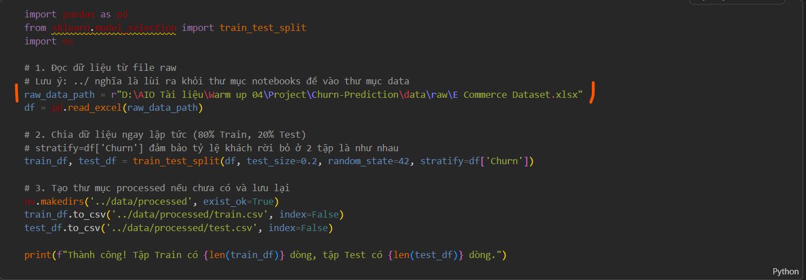

# Báo cáo Checklists

## Về nội dung dữ liệu
- Data Quality
    - Không còn missing values (hoặc đã xử lý rõ ràng)
    - Không duplicate (dữ liệu giống nhau trong bảng dữ liệu)
    - Outliers được xử lý hoặc giải thích (các ngoại lệ, như quá cao hoặc quá thấp)
- EDA
    - Có churn rate
    - Có distribution (vẽ Histogram / KDE)
    - Có correlation
    - Có phân tích theo feature (gender, tenure…)
- Output
    - Có file final_data.csv
    - có train.csv, test.csv
- góp ý:
    - nên bỏ cột ID trước khi traning

## Về hình thức trình bày
1. Cần chuẩn hóa đường dẫn theo tên đường dẫn *file project trên github (ảnh) sao cho có thể chạy file code sau khi clone project từ github về máy luôn (Các ad sẽ chạy lại file code của mình. mình cần chuẩn bị sao cho các ad clone về là có thể chạy file code luôn)

2. Nên chuẩn hóa trình biên dịch dùng để triển khai project. Nên dùng trình biên dịch tại trên máy tính (máy local) để code (như VsCode, pycharm, sublinetext, Jupyter notebook, …), rồi sau đó up lên github chứ không nên dùng google colab để chạy code, Lý do là để chuẩn hóa môi trường chạy code khi gitclone (tải dự án) từ github về.

3. Nên cho các Thư viện cần thiết vào của code vào file requirements.txt

**Người báo cáo:** QA/QC Reviewer
**Dự án:** AI Conquer 2026 - Churn Prediction